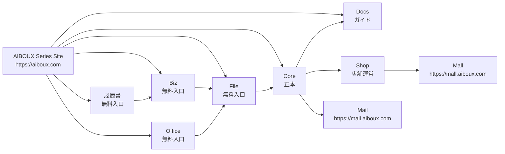

# AIBOUX Service Map

AIBOUX の各サービスの役割、URL、データ連携、入口導線を定義します。

## Confirmed Decisions

| Service | URL | 役割 |
|---|---|---|
| AIBOUX Series Site | `https://aiboux.com` | 全サービス紹介・入口・シリーズポータル |
| AIBOUX Core | `https://core.aiboux.com/` | 基幹業務、帳票、商品マスタ、在庫、得意先、納品先、卸価格の正本 |
| AIBOUX Mail | `https://mail.aiboux.com` | 業務メール、添付、取引先、請求、注文と連携するメールワークスペース |
| AIBOUX Shop | `https://shop.aiboux.com` | Shopify風の店舗運営バックオフィス |
| AIBOUX Mall | `https://mall.aiboux.com` | 一般顧客向け集客モール |
| AIBOUX File | `https://file.aiboux.com` | ファイル転送、PDF、画像、背景切り抜き、バーコード/QR作成 |
| AIBOUX Biz | `https://biz.aiboux.com` | ビジネス文書、テンプレート、Webエディタ、履歴保存 |
| Aiboux Office | `https://office.aiboux.com` | ブラウザだけでOffice/PDF/CSVをサーバー送信なしで編集 |
| AIBOUX 履歴書 | `https://rirekisho.aiboux.com` | 履歴書、職務経歴書、退職届、送付状、求人票解析、AI自己PR、証明写真作成 |
| AIBOUX Docs | `https://docs.aiboux.com` | AIBOUX全体のヘルプ・操作ガイド |

## Assumptions

- `https://aiboux.com` はアプリ本体ではなく、シリーズ全体の入口です。
- File / Biz / Office / 履歴書は無料入口、SEO入口、広告収益入口、会員登録入口、Core / Mail / Shopへの送客装置としても機能します。
- Core は商品・得意先・納品先・価格・在庫の正本です。

## Do Not Invent

- 未確定URLを勝手に確定しない。Mail は `https://mail.aiboux.com`、Mall は `https://mall.aiboux.com` で確定済み。
- `https//aiboux.com` のような誤記を使わない。
- `doc.aiboux.com` を使わない。Docs は `https://docs.aiboux.com`。
- `rirekisho.aoboux.com` を使わない。履歴書は `https://rirekisho.aiboux.com`。

## Service Relationships

## Entry Strategy

- Public Site: シリーズ全体の入口。
- File: 大容量転送、PDF/画像/バーコードからのSEO入口。
- Biz: 契約書・請求書・テンプレートからのSEO入口。
- Office: ブラウザOffice/PDF/CSV編集からのSEO入口。
- 履歴書: 求職者向け検索・会員登録入口。
- Core: 業務OS本体。
- Shop: 店舗運営者向け管理画面。
- Mail: 業務メール処理画面。URLは `https://mail.aiboux.com`。
- Mall: 一般購入者向けモール。URLは `https://mall.aiboux.com`。

## Confirmed Corrections

- Correct: `https://aiboux.com`
- Incorrect: `https//aiboux.com`
- Correct: `https://docs.aiboux.com`
- Incorrect: `doc.aiboux.com`
- Correct: `https://rirekisho.aiboux.com`
- Incorrect: `rirekisho.aoboux.com`
