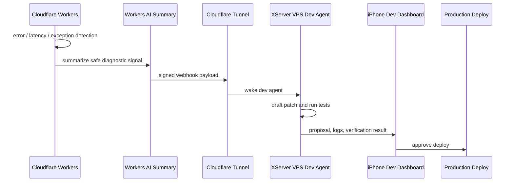

# AIBOUX Voice Operation & Dev Monitor Spec

> Archive note: This file is retained for historical traceability only. The active Source of Truth is `/home/pkkatsu/aiboux/AIBOUX_MASTER_DOCUMENT.md`.
> Any old deployment-approval wording in this archived snapshot is superseded by the current Production Deployment Rule: normal code/UI/API production deployment may run after required verification passes; `git push`, destructive operations, secret exposure/transfer, real external sending, pricing/billing changes, marketplace publication, customer/personal-data external transfer, and high-risk legal/pricing/contract/refund decisions still require human approval.

この文書は AIBOUX Mail の音声操作拡張と、Cloudflare Workers から XServer VPS 上の開発AIへ安全にエラーシグナルを渡す自律保守導線の仕様です。既存の `AIBOUX_MASTER_SPEC.md`、`AIBOUX_AI_ASSISTANT_SPEC.md`、`AIBOUX_MCP_API_SPEC.md` と矛盾させないこと。

## Confirmed Decisions

- AIBOUX Mail は音声読み上げ・音声返信メモ・AI整形下書きを扱う。
- AIは本文の要約、請求・注文・期日の抽出、公私判定、返信下書き作成までを行う。
- AIがメールを外部送信してはいけない。送信は必ず人間がUIで承認した後に限る。
- 音声入力ではフィラー、重複、言い直しを補正し、標準的なビジネス文面へ整える。
- ビジネス/プライベートの仕分けはAIのバックグラウンド自動判定を基本とし、手動タグ付け前提にしない。
- プライベート判定メールは Core の販売管理データ、横断AI参照、取引先候補へ流さない。
- 本番監視は Cloudflare Workers 側でエラー・遅延・例外を検知し、要約シグナルだけを VPS へ送る。
- Cloudflare Workers AI binding `AI` は接続済み。安全な診断APIは `GET /api/ai/health`。
- VPS上の開発AIは修正パッチと検証結果を起草するだけで、本番デプロイは管理者承認必須。

## Mail Voice UI

- Desktop/Tablet/Mobile: 右下FABから開くフローティングAI Assistantに音声要約、音声返信メモ、返信下書き候補を表示する。
- フローティングAI Assistantは初期状態で閉じ、開いた状態でもsafe-area内に収める。
- 下書き承認UIはMail AI Assistantパネル内に表示する。
- AI Assistantパネルと承認UIは白背景、細い罫線、控えめな影にする。グラデーションや過剰装飾は禁止。
- 下書き冒頭1〜2行を表示し、`送信` と `やめる` の2ボタンだけに絞る。
- `送信` は人間承認操作であり、AIの自動送信ではない。

## Business / Private Classification

業務判定シグナル:

- 署名・差出人: `株式会社`、`代表取締役`、部署名、法人系ドメイン。
- 文脈: `見積`、`請求`、`注文`、`納品`、`契約`、`支払`、`納期`。
- 業務挨拶: `お世話になっております` など。

プライベート隔離例:

- 家族間の日常連絡。
- ホテル予約、サウナ付き宿泊、個人旅行。
- ファストフードや個人消費のデジタル領収書。
- ビジネスシグナルがない販促メール。

## Dev Monitor Architecture

## Security Rules

- Webhookは署名、時刻、nonce、許可IPまたはTunnel前提で検証する。
- VPSへ送る内容は最小限のエラー要約、route、version、stack trace抜粋、再現条件に限定する。
- 顧客本文、メール本文、ファイル本文、秘密情報、APIキーをVPSへ送らない。
- VPS内エージェントはリポジトリ外の任意削除・任意デプロイをしない。
- 本番反映、外部送信、削除、課金状態変更は人間承認必須。

## TBD

- Workers AI の商用APIフォールバック条件。
- `dev.aiboux.com` など管理者ダッシュボードURLの最終確定。
- XServer VPS内の常駐エージェント実装方式。
- Webhook署名鍵のローテーション方式。
- iPhone通知の実装方式。

## Current Implementation Notes

- `src/lib/mail/ai.ts` に決定的な公私判定・音声返信下書き補正ロジックを置く。
- `src/pages/mail/api/ai/classify.ts` はtenant確認後、分類artifactを保存できる。
- `src/pages/mail/api/ai/voice-draft.ts` はtenant確認後、音声返信下書きartifactを保存できる。
- `src/components/ai/MailAIAssistantPanel.tsx` は読み上げ要約、音声返信メモ、右下承認UIを持つ。
- Mail AI Assistant はDesktop/Tablet/Mobileすべてで初期状態では閉じ、Topbarまたは右下フローティングボタンから浮遊ウィンドウとして開く。
- Mail AI Assistant のフローティングウィンドウは `100dvh` と `safe-area-inset-*` を考慮し、上部や下部が画面外へ欠けないようにする。
- 音声入力成功状態はToastではなくパネル内のインライン状態表示を基本にし、モバイルでAI Sheet上部を覆わないようにする。エラーはToastでも通知できる。
- `src/components/mail/MailThreadView.tsx` はAI公私判定をメール詳細で表示する。
- `src/lib/server/cloudflareAi.ts` はCloudflare Workers AI共通クライアント。
- `src/pages/api/ai/health.ts` はbinding確認と管理トークン付き実推論診断。
- `tools/codex-aiboux-mcp/server.mjs` はCodexからAIBOUX/Cloudflare AI診断を呼ぶローカルMCPサーバー。
